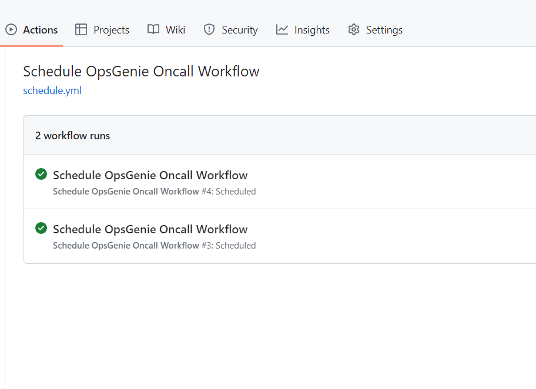

# Port Integration with OpsGenie

## Getting started

In this example you will create a blueprint for `service` entity that ingests `who is on call` data from OpsGenie using REST API. Then you will add some Python code to create new entities in Port every time a Github Action is triggered by a schedule.

### Service Blueprint
Create the `service` blueprint in Port [using this json file ](./opsgenie/oncall_blueprint.md)

### Github Action yaml
Place this example `.github/workflows/schedule.yml` file in your project's root folder

### Github CI/CD Variables
To interact with Port using Github Action, you will first need to define your Port credentials [as variables for your workflow](https://docs.github.com/en/actions/learn-github-actions/variables). Then, pass the defined variables to your ci pipeline script. Ensure to add your OpsGenie API key as well to the variables.

#### Screenshot - Pipeline Success

#### Screenshot - Port UI
